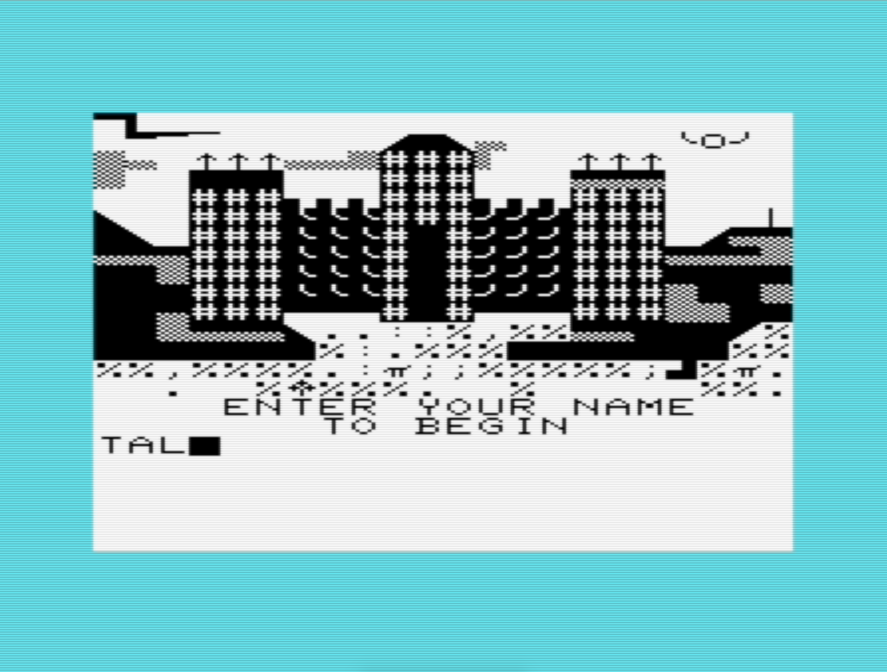
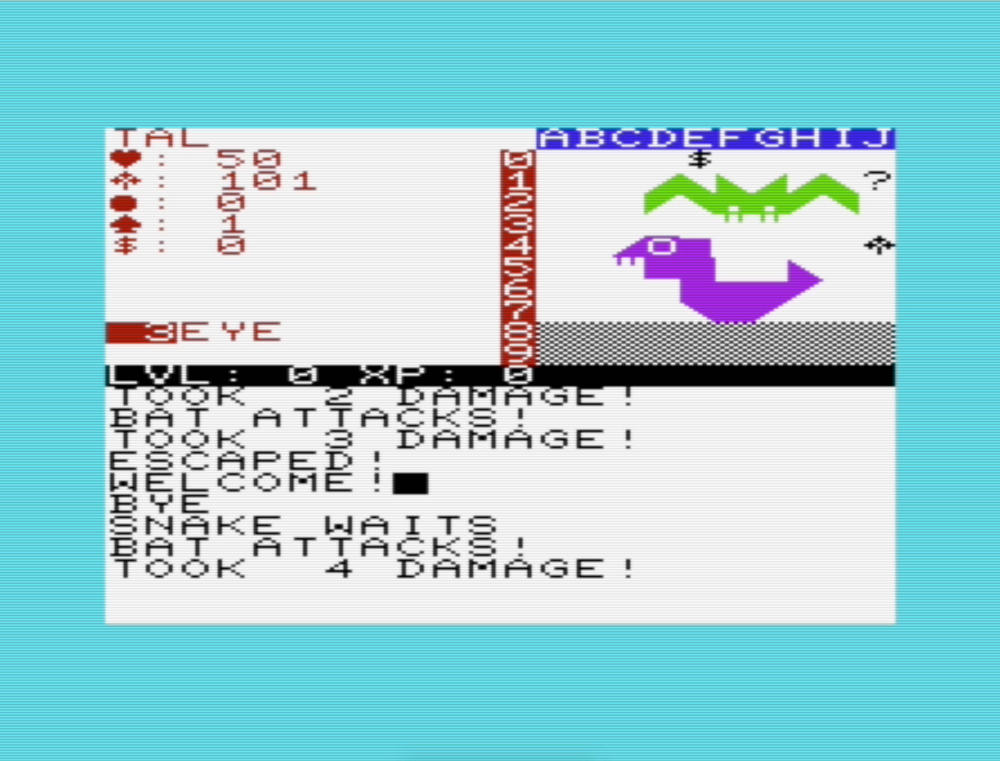

# Wild Green
## An adventure RPG for the Commodore Vic-20.

 

## System Requirements
Unexpanded Commodore Vic-20 (PAL/NTSC).

## Instructions
You must collect 3 gems of power to gain the power to destroy the cursed Castle
Wild Green.

## Commands
You issue a command by typing the character of the corresponding command. Valid
commands are listed below.

### Take (T)
To take an object, you provide a coordinate as a row/column position represented 
by the onscreen grid. For example, "A1" refers to row 1, column 1. "A3" 
represents row 3, column 1. You can use the cursor keys to adjust the target.

### Cast (C)
Spells are provided by typing the number of the spell. Spells are numbered
from 0-4.  You can learn spells by picking up `♣`'s. Known spells are listed
below your statistics on the left side of the game viewport.

### Hit (H)
Hitting a target randomly moves a cursor around the screen.  Try to press 
RETURN when the cursor is over the enemy you wish to strike. Missing a target
will result in a wasted turn.

### Run (R)
Attempts to flee from the current screen. If there are hostiles in the room, 
running may not always succeed. If you fail to escape, you will lose a turn.

## Tips
* Level up by defeating enemies to increase your damage and health.

* Be careful when TAKE'ing traps (`?`'s). They may contain health or magick, but 
  they may be traps!  You can use the `EYE` spell to de-trap them if you don't
  want to take chances.

* You may happen upon a shop instead of a room on occasion. Here you can spend
  money acquired on your travels to buy armor, weapons, spells, health, and 
  magick.
