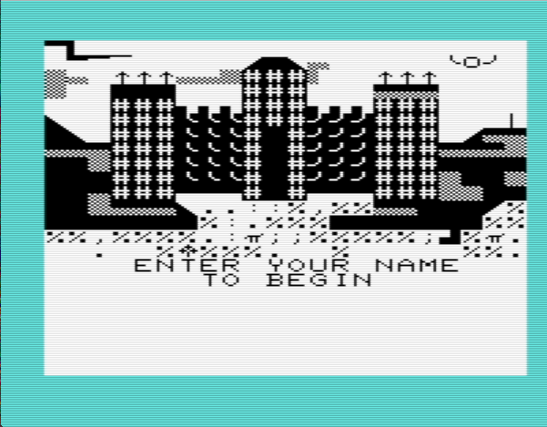
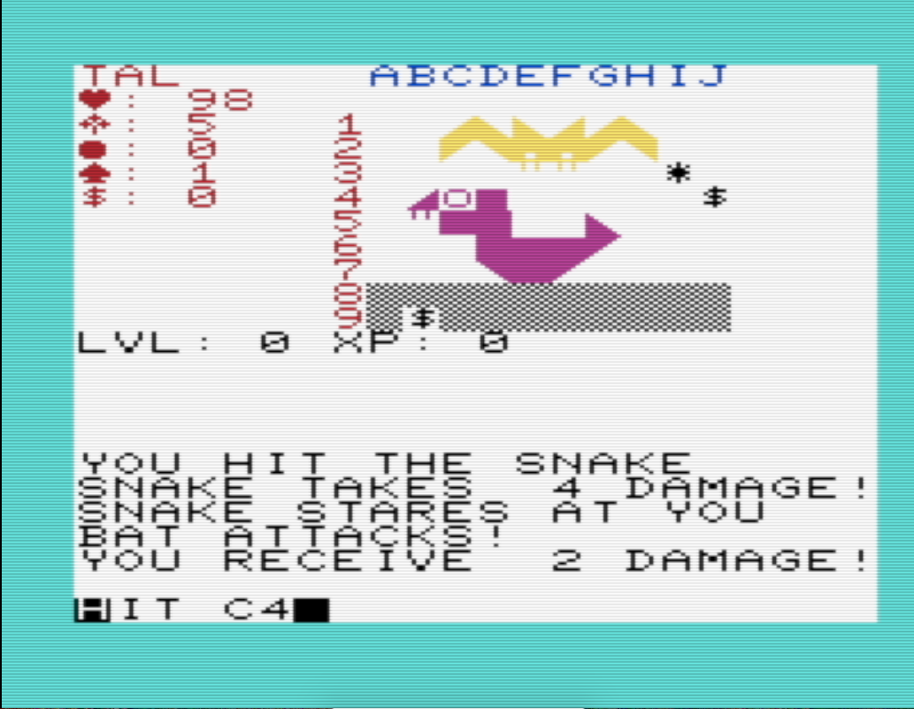

# Wild Green
### An adventure RPG for the Commodore Vic-20.

 

### System Requirements
Unexpanded Commodore Vic-20 (PAL/NTSC).

### Instructions
You must collect 3 gems of power to gain the power to destroy the cursed Castle
Wild Green.

Commands are issued by typing one of the following characters:

 | command | Description                                                            |
 | ------- | ---------------------------------------------------------------------- |
 | T       | take the object at the target location                                 |
 | H       | hit the given target                                                   |
 | R       | run from enemies to the next room (always succeeds if room is cleared) |
 | C       | cast the given spell                                                   |

Targets are provided as coordinates as row/column positions represented by the
onscreen grid. For example, "A1" refers to row 1, column 1. "A3" represents
row 3, column 1. You can use the cursor keys to adjust the target.

Spells are provided by typing the number of the spell. Spells are numbered
from 0-4.

To confirm a command, press `<RETURN>`.

### Tips
Level up by defeating enemies to increase your damage and health.

Be careful when TAKE'ing traps (`?`'s). They may contain health or magick, but 
they may be traps!  You can use the `EYE` spell to de-trap them if you don't
want to take chances.

You may happen upon a shop instead of a room on occasion. Here you can spend
money acquired on your travels to buy armor, weapons, spells, health, and 
magick.
